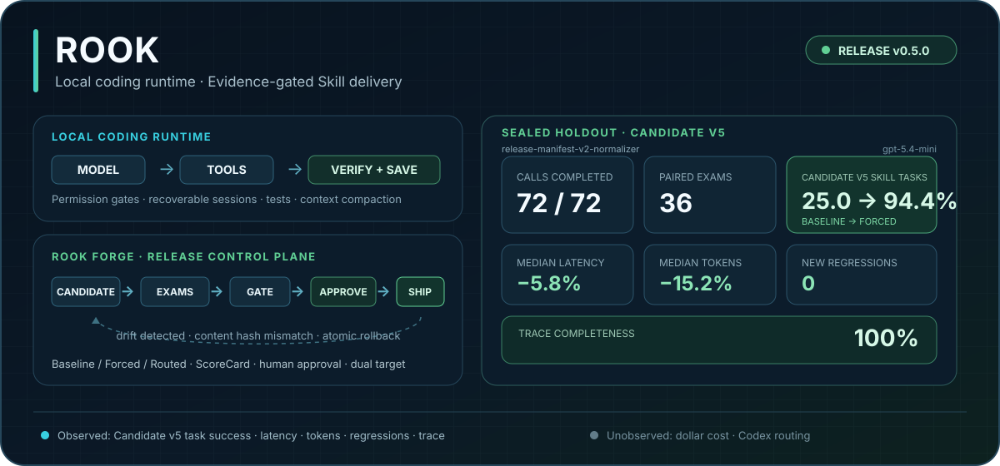

<p align="center">
  <picture>
    <source media="(max-width: 600px)" srcset="assets/readme/hero-mobile.svg">
    
  </picture>
</p>

<h1 align="center">Rook</h1>

<p align="center">
  <strong>A local Python coding agent with an evidence-gated Skill release plane.</strong>
</p>

<p align="center">
  <a href="https://github.com/Lem0nTea2002/Rook/releases/tag/v0.5.0"></a>
  <a href="https://github.com/Lem0nTea2002/Rook/actions/workflows/offline-tests.yml"></a>
  
  <a href="README.zh-CN.md">简体中文</a>
</p>

Rook reads and edits code in a local workspace, calls tools, runs tests, and keeps
recoverable sessions. Its built-in **Rook Forge** treats Skills as releasable software:
quarantine the Candidate, run paired exams, enforce gates, require human approval,
deploy per target, detect drift, and roll back atomically.

> Rook completes coding tasks. Rook Forge decides whether a Skill has enough evidence to ship.

## Verified evidence

This sealed holdout evaluates Candidate v5, the `release-manifest-v2-normalizer` Skill,
with `gpt-5.4-mini`.

| Measurement | Observed result |
| --- | --- |
| Sealed `gpt-5.4-mini` holdout | 72/72 calls completed; 36 comparable pairs |
| Candidate v5 Skill task success | Baseline 25.0% → Forced 94.4% (+69.4pp) |
| Efficiency | Median latency -5.8%; median fully observed tokens -15.2% |
| Safety and audit | 0 new regressions; 100% trace completeness |
| Offline CI | 2,000+ tests across Ubuntu/Windows and Python 3.11/3.12; exact counts stay in CI |

The Formal used a **sealed holdout**. Dollar cost and Codex routing activation were
unobserved, so Rook makes no claim about either. Fake-Agent demos verify the control
plane and user flow; they do not measure model effectiveness. The current project-memory
Pilot is Baseline 0% / Memory 0%, and its 20-pair Formal remains pending.

Evidence trail:

- [Formal result and claim boundary](docs/PORTFOLIO_EVIDENCE.md#completed-candidate-v5--adapter-v12-formal)
- [Release lifecycle receipt](docs/evidence/rm2-v5-formal-release-2026-07-27.json)
- [Full-repository and scale execution](docs/FULL_REPO_AND_SCALE.md)
- [Portfolio evidence contract](docs/PORTFOLIO_EVIDENCE.md)

## See the product loop


This GIF uses Rook's real Textual components and a deterministic Fake Agent. It demonstrates
the inspectable flow without a Provider call or API cost. The
[three-minute interview script](docs/THREE_MINUTE_DEMO.zh-CN.md) runs Coding Task → Tool Call
→ Skill exam → gate → approval → deploy → drift → rollback.

## How it works

| Runtime | Release control plane |
| --- | --- |
| Model → permissioned tool call → result → verification | Candidate → Baseline/Forced/Routed exams → Evaluator + ScoreCard |
| Streamed output, visible tool cards, todos, and errors | Automatic gate → human approval → per-target deployment |
| Persistent sessions, context projection, and compaction | Stale/drift detection → content-hash validation → atomic rollback |

The automatic gate only decides release eligibility; it never activates a Skill. Human
approval cannot bypass a safety failure, secret leak, new regression, stale evidence, or
content-hash mismatch. Rook and Codex are independent deployment targets.

## Quickstart

Install the tagged release and open the TUI:

```bash
pipx install --backend pip "git+https://github.com/Lem0nTea2002/Rook.git@v0.5.0"
rook
```

The first-launch wizard configures Provider, model, Base URL, and API key without sending
a model request. Run one task directly:

```bash
rook --message "Inspect this project and fix the failing test"
```

Exercise the complete Rook Forge lifecycle with deterministic fixtures and zero model cost:

```bash
rook eval demo
```

## What ships in Rook

| Capability | What it provides |
| --- | --- |
| Coding agent | Read, search, edit, run commands, and verify changes |
| Coding workbench | Selectable output, Slash Palette, `@` files, controlled shell, diff, and transcript |
| Visible agent loop | Stream model output, tool calls, results, permission requests, and todos |
| Permissions and sessions | Explicit ASK, AUTO, or local-only FULL access; persist, resume, and compact sessions |
| Confirmed learning | Detect verified recovery for free, then let the user save project memory or quarantine a Skill Candidate |
| Rook Forge | Isolated paired exams, ScoreCards, release gates, human approval, dual-target deployment, and rollback |
| Mobile channels | Paired Feishu/WeChat DMs submit tasks and approve one sensitive action |
| External review | Submit read-only workspace/range/commit reviews to Review Agent and retain Finding provenance |

## Permissions and recoverable sessions

| Mode | Boundary |
| --- | --- |
| `ASK` | Ask for every permission-bearing file, Shell, network, environment, and Git action |
| `AUTO` | Allow ordinary in-project file access and an explicit safe command list; ask for network, deletion, project escape, secrets, and risky Git |
| `FULL` | Local TUI/CLI only; bypass confirmation after explicit session risk acknowledgement while retaining redacted audit events |

`Shift+Tab` cycles `ASK` and `AUTO`; enter `FULL` through `/permissions`. Mobile channels,
EvalOps, and Candidate sandboxes cannot inherit `FULL`.

After a turn, a deterministic detector looks for a real failure followed by a corrected
action and successful verification. `/learn last` asks the current Provider to draft a
structured lesson; the user can save it under `.rook/memory/`, dismiss it, mark a runtime
defect, or send a cross-project procedure to Rook Forge as a quarantined Candidate.
Unconfirmed or stale memory is never loaded, and no Candidate activates itself.

## TUI coding workbench


| Input / shortcut | Purpose |
| --- | --- |
| `/status`, `/usage`, `/diff` | Inspect project state, observed usage, and a separate diff viewer |
| `/copy last\|code\|selection\|transcript` | Copy a reply, code block, selection, or the full session |
| `@src/app.py` | Reference a bounded project file snapshot with escape checks |
| `!git status` / `!` | Run once / toggle controlled shell through permissions, audit, and cancellation |
| `Ctrl+R` | Search project-scoped prompt history |
| `Ctrl+X Ctrl+E` | Edit the prompt with `$VISUAL` or `$EDITOR` |
| `Shift+Tab` | Cycle `ASK` and `AUTO`; `FULL` requires `/permissions` |
| `Enter` / `Alt+Enter` while running | Steer the current turn / queue the next task |

Long output expands on demand. The full transcript remains in state while the UI mounts
only the latest 200 entries. Rookie remains the startup mascot and steps aside after the
first message.

<p align="center">
  
</p>

## Review Agent integration

Rook can call an independently running
[Review Agent](https://github.com/Lem0nTea2002/Review-Agent). Configure the service URL,
project alias, and reviewers in `rook.toml`; store the administrator password in the
operating-system keyring:

```toml
[review]
url = "http://127.0.0.1:8080"
project = "rook"
reviewers = ["local", "ocr"]
```

```powershell
rook review login --username admin
rook review doctor
rook review run --target workspace
rook review report <task-id>
```

Reports retain `local-rules` and `open-code-review` sources. Applying a selected finding
creates a normal Rook coding task, so file edits, Shell commands, and tests keep the same
permission path.

## Mobile control

A local gateway accepts tasks from paired Feishu or WeChat private chats and pauses for
one sensitive-action approval. Project files, model credentials, the Agent Loop, Skills,
and tool execution remain on the computer.

```powershell
pipx inject rook-agent "lark-oapi>=1.7,<2" "qrcode>=8,<9"
rook channel project add rook --path "D:\absolute\path\to\Rook"
rook channel setup feishu
rook channel login weixin
rook channel pair create --channel feishu --project rook
rook channel serve --channels feishu,weixin
```

Only paired private users and explicitly whitelisted projects are accepted. Mobile
approval is allow-once or deny and expires as denial after five minutes.


[Setup and security model](docs/MOBILE_CHANNELS.md) ·
[Redacted live acceptance evidence](docs/evidence/rook-weixin-live-acceptance-2026-07-29.json)

## Project-memory benchmark

The benchmark pairs Baseline and Memory arms from the same commit, workspace hash, model,
tool schema, container, and request budget. Stale, revoked, and unconfirmed records are
negative controls; loading one invalidates the evidence.

| Stage | Current evidence |
| --- | --- |
| M0 offline readiness | Runtime, redaction, paired orchestration, ScoreCard, and stable reports verified with 0 Provider calls |
| Latest Pylint/Xarray Pilot | `pylint-dev__pylint-7114` and `pydata__xarray-3364`: Baseline 0% / Memory 0%; the Xarray Memory patch regressed existing behavior; no Validator success |
| 20-pair Formal | Pending; the 0% / 0% Pilot is not a resume metric |

Verify the public catalog without a model call:

```bash
rook benchmark memory verify --catalog benchmark/memory/v1/catalog.json
```

[M0 readiness](docs/benchmarks/MEMORY_M0_READINESS_2026-08-03.zh-CN.md) ·
[frozen A/B design](docs/benchmarks/MEMORY_AB_FREEZE_V1.zh-CN.md) ·
[Pilot timeline](docs/benchmarks/MEMORY_PILOT_V1_2026-08-01.zh-CN.md)

## Configuration

```bash
rook config setup
rook config init
rook config path
rook config show
```

Rook supports OpenAI, DeepSeek, Qwen, Moonshot, Zhipu, OpenRouter, Anthropic, Ollama,
and custom OpenAI-compatible endpoints. Hidden API-key input is stored in the operating-
system credential manager. Environment variables can override stored credentials:

```bash
export OPENAI_API_KEY="your-openai-api-key"
export OPENAI_MODEL="gpt-4.1-mini"
```

The main provider path uses OpenAI Chat Completions-compatible APIs with
OpenAI-compatible streaming and normalized errors such as `PROMPT_TOO_LONG`. Rook does
not yet use the OpenAI Responses API; native reasoning and multimodal support remain
future work. The Anthropic Provider remains experimental and does not expose
native thinking/cache/streaming.

## Architecture

```text
rook_agent/
├── agent/          # Model → Tool → Model loop
├── tools/          # File, search, edit, and command tools
├── permissions/    # Policy checks and human confirmation
├── context/        # Sessions, context projection, and compaction
├── providers/      # Model providers
├── channels/       # Feishu/WeChat adapters, pairing, queues, and approvals
├── evolution/      # Recovery detection, confirmed memory, and Candidate routing
└── evalops/        # Rook Forge exam and release control plane
```

## Development

Linux/macOS:

```bash
python3 -m venv .venv
.venv/bin/python -m pip install -e ".[dev]"
.venv/bin/python -m pytest
```

Windows PowerShell:

```powershell
py -3.11 -m venv .venv
.\.venv\Scripts\python.exe -m pip install -e ".[dev]"
.\.venv\Scripts\python.exe -m pytest
```

## Documentation

- [Documentation index](docs/README.md)
- [Codebase reading guide](docs/CODEBASE_READING_GUIDE.md)
- [Agent Loop guardrails](docs/AGENT_LOOP_GUARDRAILS.md)
- [Rook Forge offline demo](docs/DEMO.md)
- [Issue-to-PR demo](docs/ISSUE_TO_PR_DEMO.md)
- [Contributing](CONTRIBUTING.md) · [Security](SECURITY.md) · [License](LICENSE)
