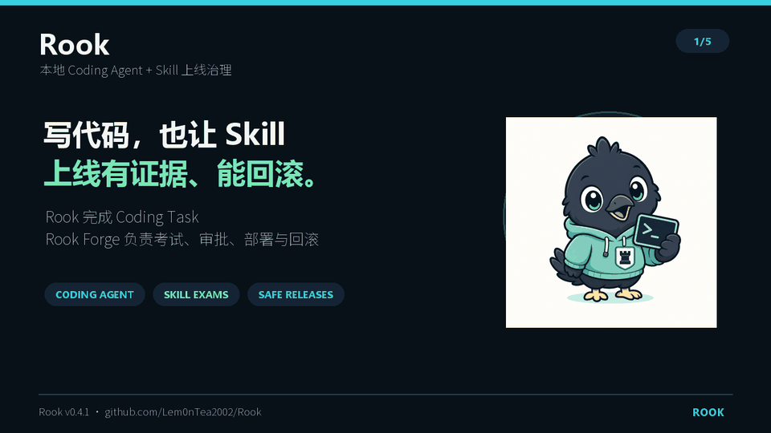
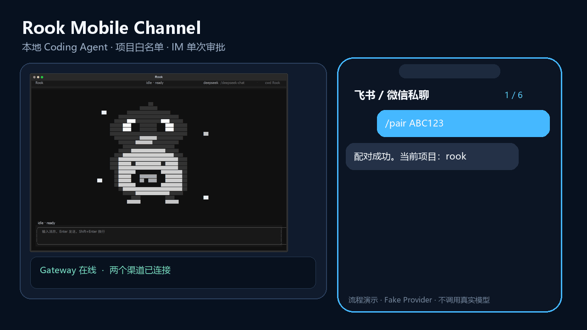
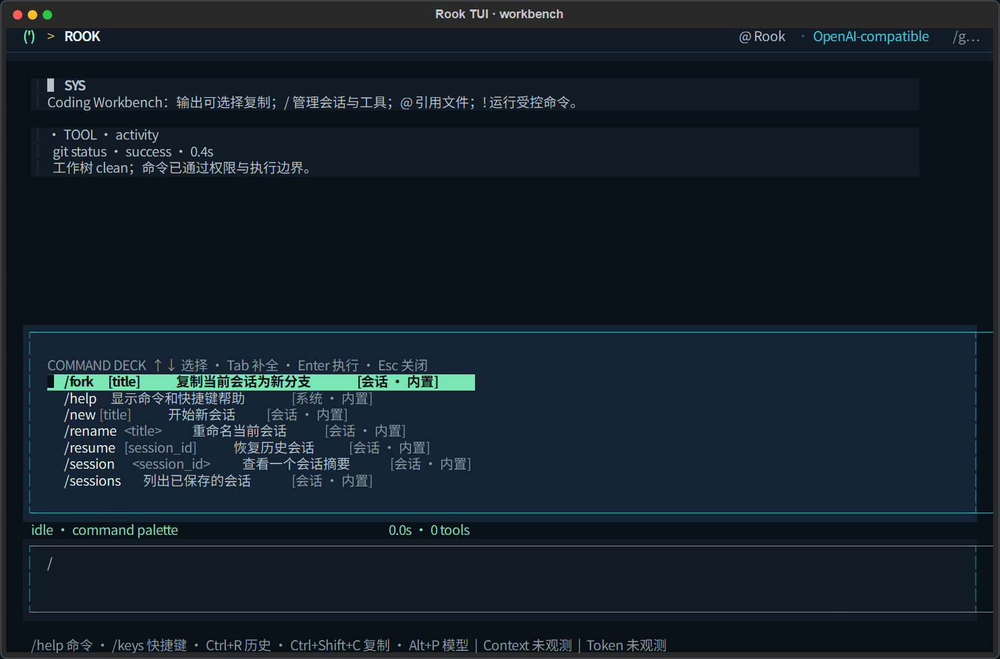
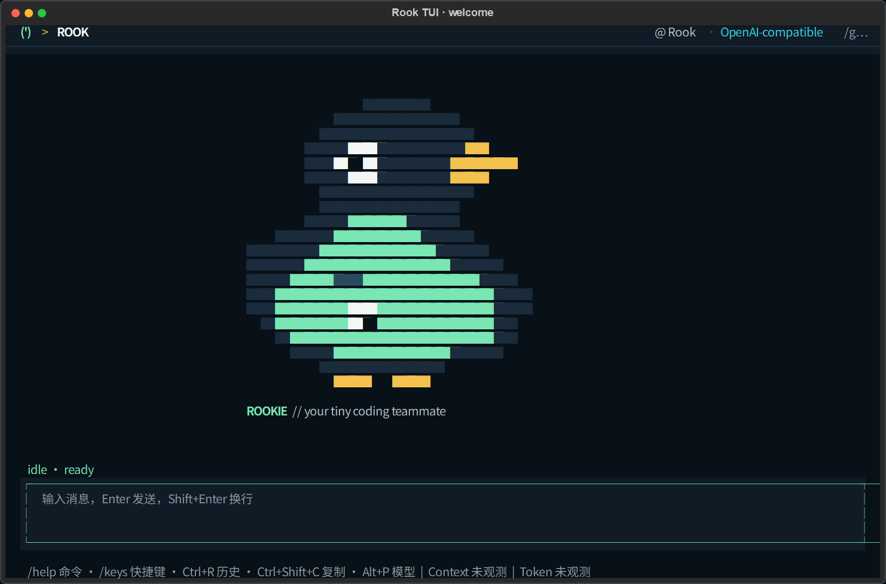

<p align="center">
  
</p>

<h1 align="center">Rook</h1>

<p align="center">
  <strong>本地 Python Coding Agent，内置 Skill 考试、审批、部署与回滚。</strong>
</p>

<p align="center">
  <a href="https://github.com/Lem0nTea2002/Rook/releases/tag/v0.4.1"></a>
  <a href="https://github.com/Lem0nTea2002/Rook/actions/workflows/offline-tests.yml"></a>
  
  <a href="README.md">English</a>
</p>

Rook 能在本地工作区读取和修改代码、调用工具、运行测试，并保存可恢复的会话。
内置的 **Rook Forge** 则负责判断一个 Skill 是否值得上线。

> Rook 负责完成 Coding Task；Rook Forge 负责 Skill 的考试、审批、部署与回滚。

## 演示



## 快速开始

```bash
pipx install "git+https://github.com/Lem0nTea2002/Rook.git@v0.4.1"
rook
```

第一次交互启动时，Rook 会引导配置 Provider、模型、Base URL 和 API Key；
配置过程不会发送模型请求。

发送单条任务：

```bash
rook --message "读取这个项目，修复失败的测试"
```

不配置模型、零成本体验 Rook Forge：

```bash
rook eval demo
```

## 主要能力

| 能力 | 说明 |
| --- | --- |
| Coding Agent | 读取、搜索、修改代码，运行命令和测试 |
| Coding Workbench | 可复制输出、Slash Palette、`@` 文件、受控 Shell、Diff 和 Transcript |
| 可见的 Agent Loop | 在 TUI 中展示流式输出、工具调用、结果、权限请求和待办 |
| 权限与会话 | 高风险操作先确认；会话可持久化、恢复和压缩 |
| 手机渠道 | 已配对的飞书/微信私聊可远程提交任务，并在 IM 中单次审批 |
| Skill 考试 | 隔离运行 Baseline、Forced 和 Routed 配对实验 |
| Skill 发布 | 自动门禁后仍需人工审批，支持 Rook/Codex 独立部署与回滚 |

## 手机飞书 / 微信控制本地 Rook

Rook v0.4.1 可在电脑上运行本地 Gateway。手机只负责发送任务和完成单次权限
审批；项目文件、模型凭据、Agent Loop、Skill 和工具执行仍留在电脑。

```powershell
pipx inject rook-agent "lark-oapi>=1.7,<2" "qrcode>=8,<9"
rook channel project add rook --path "D:\absolute\path\to\Rook"
rook channel setup feishu
rook channel login weixin
rook channel pair create --channel feishu --project rook
rook channel serve --channels feishu,weixin
```

`channel setup feishu` 默认通过飞书官方二维码创建独立应用，并把 Secret 直接
写入操作系统凭据库。复用已有应用时使用 `--app-id cli_xxx`，Secret 只在本机
隐藏输入；不要把它发送到聊天或命令行参数。

入口只接受已配对用户的私聊文本和本机白名单项目。敏感工具会暂停：飞书显示
审批卡片，微信显示 6 位码；只能允许一次或拒绝，5 分钟超时自动拒绝。TUI 与
手机入口复用同一权限管理器、Session Store 和项目执行锁。



[完整配置与安全边界](docs/MOBILE_CHANNELS.zh-CN.md)

[脱敏的微信 iLink + DeepSeek 真实验收证据](docs/evidence/rook-weixin-live-acceptance-2026-07-29.json)

## Rook Forge 如何工作

```text
Candidate 隔离
      ↓
Baseline / Forced / Routed 考试
      ↓
Evaluator + ScoreCard
      ↓
自动门禁 → 人工审批 → 按目标部署
      ↓
stale / drift 检测 → 原子回滚
```

自动门禁只决定“是否具备上线资格”，不会自动激活 Skill。安全失败、秘密泄漏、
新增回归、stale 或内容哈希不一致不能被人工绕过。

## TUI · Coding Workbench

输入 `/` 会立即打开命令面板，可按名称、分类或中文说明搜索，使用上下键选择、
Tab 补全、Enter 执行。`/model`、`/resume`、`/use`、`/mode` 等命令支持二级参数补全。



常用输入与快捷键：

| 输入 / 快捷键 | 作用 |
| --- | --- |
| `/status`、`/usage`、`/diff` | 查看项目状态、真实可观测用量和独立 Diff Viewer |
| `/copy last\|code\|selection\|transcript` | 复制回复、代码块、所选文本或完整会话 |
| `@src/app.py` | 安全引用项目文件；拒绝越界，限制单文件与总快照大小 |
| `!git status` / 单独 `!` | 单次运行 / 切换受控 Shell，复用权限、沙箱、审计和取消 |
| `Ctrl+Shift+C` | 优先复制当前选择；没有选择时复制最后一条 Rook 回复 |
| `Ctrl+R` | 搜索当前项目 Prompt 历史 |
| `Ctrl+X Ctrl+E` | 用 `$VISUAL` 或 `$EDITOR` 编辑当前 Prompt |
| `Shift+Tab` | 在安全的权限模式间切换，不会进入 bypass |

输出、Markdown、代码块和 Tool Card 均可鼠标选择。长工具输出可点击展开；完整
Transcript 保留在状态层，界面只挂载最近 200 条，避免长会话持续变慢。每次启动时
Rookie 会出现在欢迎区，发送第一条消息后自动让出工作空间。



角色使用终端原生彩色字符绘制，不依赖 Kitty/Sixel 图片协议。两张截图均由 Rook
真实 Textual 组件和固定演示数据离线渲染，不调用模型。

## 可信结果

| 验证 | 结果 |
| --- | --- |
| `gpt-5.4-mini` Formal | 72/72 次调用，36 个可比配对；Baseline 25% → Forced 94.4%（+69.4pp） |
| 效率与安全 | 中位时延 -5.8%，中位 Token -15.2%，新增回归 0，轨迹完整度 100% |
| 跨平台 CI | Ubuntu 1844 passed / 8 skipped；Windows 1845 passed / 7 skipped |
| 发布生命周期 | 真实完成门禁、人工审批、双目标部署、漂移检测与原子回滚 |

Formal 使用 sealed holdout；美元成本和 Codex 路由激活未观测，因此不做估算。
Fake Agent 演示只验证控制链路，不冒充真实模型效果。

详细证据：

- [简历证据合同](docs/PORTFOLIO_EVIDENCE.zh-CN.md)
- [Formal 结果](docs/PORTFOLIO_EVIDENCE.zh-CN.md#已完成的-candidate-v5--adapter-v12-formal)
- [真实发布生命周期](docs/evidence/rm2-v5-formal-release-2026-07-27.json)
- [完整仓库任务与规模执行](docs/FULL_REPO_AND_SCALE.md)

## 配置

```bash
rook config setup
rook config init
rook config path
rook config show
```

`rook config setup` 支持 OpenAI、DeepSeek、Qwen、Moonshot、智谱、
OpenRouter、Anthropic、Ollama 和自定义 OpenAI-compatible 接口。API Key
通过隐藏输入读取并保存到操作系统凭据库，不写入 `config.toml`。

环境变量优先于系统凭据和配置文件，例如：

```bash
export OPENAI_API_KEY="your-openai-api-key"
export OPENAI_MODEL="gpt-4.1-mini"
```

自定义 OpenAI-compatible Provider 默认使用 `ROOK_API_KEY`、
`ROOK_BASE_URL` 和 `ROOK_MODEL`。ChatGPT/Codex 订阅登录与 OpenAI API
认证相互独立，Rook 当前不会复用 Codex 登录。

配置文件：

```text
全局：~/.config/rook/config.toml
项目：./rook.toml
```

项目可在 `rook.toml` 中定义命令、界面和快捷键：

```toml
[commands.review]
description = "审查当前修改"
argument_hint = "[path]"
prompt = "请审查以下范围，并重点检查安全和回归：$ARGUMENTS"

[ui]
language = "zh-CN"
theme = "rook" # 或 high-contrast

[keybindings]
search_history = "ctrl+r"
open_model_picker = "alt+p"
```

项目命令覆盖同名全局命令，但不能覆盖内置命令。命令模板只支持
`$ARGUMENTS` 与 `@文件`；不允许直接嵌入 Shell。无效配置由 `/doctor` 报告，
不会阻止 Rook 启动。

当前主线使用 OpenAI Chat Completions-compatible 接口和 OpenAI-compatible
流式实现，并规范化 `PROMPT_TOO_LONG` 等错误。Rook 尚未使用 OpenAI Responses
API，因此原生 reasoning 与多模态仍属于后续能力。Anthropic Provider 仍为
实验性，尚不提供原生 thinking/cache/streaming。

## 项目结构

```text
rook_agent/
├── agent/          # Model → Tool → Model 执行循环
├── tools/          # 文件、搜索、编辑和命令工具
├── permissions/    # 权限策略与人工确认
├── context/        # 会话、上下文投影与压缩
├── providers/      # 模型 Provider
├── channels/       # 飞书 / 微信 Adapter、配对、队列与 IM 审批
└── evalops/        # Rook Forge 考试与发布控制面
```

## 文档

- [技术文档入口](docs/README.zh-CN.md)
- [手机飞书 / 微信接入](docs/MOBILE_CHANNELS.zh-CN.md)
- [代码阅读指南](docs/CODEBASE_READING_GUIDE.zh-CN.md)
- [Rook Forge 离线演示](docs/DEMO.md)
- [Issue → PR 演示](docs/ISSUE_TO_PR_DEMO.md)
- [技术文章：把 Skill 当成软件发布](docs/articles/ROOK_FORGE_FROM_SKILL_TO_RELEASE.zh-CN.md)

## 开发

```bash
python -m venv .venv
.venv/bin/python -m pip install -e ".[dev]"
.venv/bin/python -m pytest
```

Rook 的目标很直接：做一个真实可运行、边界清楚，并且能够从头读懂的 Coding
Agent；再用 Rook Forge 让 Skill 上线有证据、可审计、能回滚。
