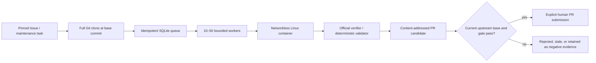

# Full-repository execution and scale control plane

## What is implemented

Rook now has a second execution path beside small repository-shaped fixtures:
an immutable catalog can point at a complete GitHub repository, exact base
commit, and verified Issue or maintenance pull request. The checked-in catalog
contains 24 SWE-bench Lite tasks:

| Repository | Tasks |
| --- | ---: |
| `pytest-dev/pytest` | 8 |
| `scikit-learn/scikit-learn` | 8 |
| `sphinx-doc/sphinx` | 8 |

Eleven records resolve to a linked GitHub Issue. Thirteen upstream fixes do not
declare a closing Issue and are explicitly recorded as
`maintenance_pull_request`; they are never mislabeled as Issues. The dataset is
locked to revision `6ec7bb89b9342f664a54a6e0a6ea6501d3437cc2`.

The Agent receives the upstream problem statement and base commit. Gold
patches, verifier patches, `FAIL_TO_PASS`, and `PASS_TO_PASS` names are excluded
from the catalog; only their SHA-256 values are retained. The official
SWE-bench harness remains the score authority.



The production-oriented execution package provides:

- strict JSONL catalog loading and catalog/provenance fingerprints;
- complete local or GitHub cloning with detached exact-commit checkout,
  disabled Git hooks, no submodule recursion, and clean-tree verification;
- content-addressed PR candidates with changed-path allowlists and validation
  hashes;
- a SQLite WAL queue with unique idempotency keys, expiring leases, retry
  budgets, dead letters, event history, and startup recovery;
- 1–50 concurrent workers, token-bucket start limiting, deterministic fault
  injection, and classified retryable/permanent errors;
- Docker jobs restricted to an administrator allowlist of image digests and
  workspace-root-relative paths;
- Docker `--network=none`, read-only root filesystem, dropped Linux
  capabilities, `no-new-privileges`, CPU/memory/PID ceilings, bounded `/tmp`,
  process-tree timeout cleanup, and redacted/bounded output;
- Prometheus text output plus an optional official Prometheus HTTP adapter, and
  optional OpenTelemetry/OTLP tracing through `rook-agent[scale]`.

Queue execution is intentionally **at least once**. Enqueue is idempotent, but a
handler that performs an external side effect must also use the job
idempotency key or its own transactional outbox. Rook does not claim exactly-once
delivery across a process crash.

## Commands

Validate the locked task and evidence boundary without network access:

```sh
rook repo verify-catalog \
  --tasks benchmark/full_repo/tasks.swebench-lite-24.jsonl
```

Export only Agent-visible fields for the existing SWE-bench prediction runner:

```sh
rook repo export-swebench \
  --tasks benchmark/full_repo/tasks.swebench-lite-24.jsonl \
  --output runs/swebench-full-repo-24.jsonl
```

Materialize one exact full repository. Network access is a separate explicit
choice; a trusted local mirror can be supplied with `--source`.

```sh
rook repo materialize \
  --tasks benchmark/full_repo/tasks.swebench-lite-24.jsonl \
  --task-id pytest-dev__pytest-11143 \
  --workdir /tmp/rook-full-repo \
  --allow-network
```

Run the cost-free scale benchmark:

```sh
rook scale benchmark \
  --jobs 300 \
  --workers 10,25,50 \
  --work-milliseconds 250 \
  --fault-every 17 \
  --output .rook/scale/report.json
```

Production metric exporters are optional:

```sh
pip install "rook-agent[scale]"
rook scale worker \
  --db .rook/execution/jobs.db \
  --workspace-root /srv/rook/workspaces \
  --allow-image "python@sha256:<64 hex>" \
  --workers 25 \
  --prometheus-port 9464 \
  --otel-endpoint http://otel-collector:4318/v1/traces
```

The worker accepts only strict JSON documents previously submitted with
`rook scale enqueue`; it does not accept an arbitrary shell string.

## Current measured control-plane result

The checked-in Windows result used 300 jobs per profile, a deterministic 250ms
payload, and one injected recoverable failure every 17 jobs:

| Workers | Throughput | P95 | Result |
| ---: | ---: | ---: | --- |
| 10 | 38.17 jobs/s | 266ms | 300/300, 17/17 faults recovered |
| 25 | 80.34 jobs/s | 297ms | 300/300, 17/17 faults recovered |
| 50 | 106.65 jobs/s | 844ms | 300/300, 17/17 faults recovered |

Throughput improved 2.10x from 10 to 25 workers and 2.79x from 10 to 50.
The 50-worker P95 increase is retained as a saturation signal, not hidden.
This is a queue/recovery benchmark, not an Agent-success, Docker-throughput, or
model-latency result. See [the full report](EXECUTION_SCALE_REPORT.md) and
[immutable JSON evidence](evidence/rook-execution-scale-2026-07-27.json).

The real Docker test is opt-in locally and mandatory in the Ubuntu CI job. It
resolves the pulled image to `image@sha256`, then verifies a mounted workspace
and denies an outbound socket. The Windows/Linux unit suite never starts a
model or incurs model costs.

A real no-model network clone also materialized the pytest task
`pytest-dev__pytest-11143` at exact commit
`6995257cf470d2143ad1683824962de4071c0eb7`: 606 files, a clean detached tree,
disabled hooks, and submodule recursion off. This validates materialization,
not task resolution; no test suite or Agent ran. See
[the materialization evidence](evidence/full-repo-materialization-2026-07-27.json).

## Honest boundary for upstream PR evidence

The 24 locked cases are historical upstream Issue/PR pairs for reproducible
full-repository evaluation. Their fixes are already merged upstream, so Rook
must not submit their replay patches as new PRs.

The portfolio target of 20–30 completed live runs and 3–5 **new** upstream PRs
requires a separate current-issue track:

1. select currently open, maintainer-accepted Issues;
2. freeze the Candidate and base commit;
3. run the full repository and official project validation;
4. preserve failures, gate rejections, and rollbacks;
5. submit only non-stale candidates after explicit human review;
6. record third-party review and merge state without manufacturing adoption.

Until those external runs and maintainer decisions happen, the safe claim is
“implemented and benchmarked the full-repository execution platform,” not
“completed 24 live fixes” or “merged upstream PRs.”

The current three-repository contribution batch, including rejected duplicate
tasks, clone failures, and the mandatory human-review gate, is tracked in
[Live upstream contribution track](UPSTREAM_CONTRIBUTIONS.md).
